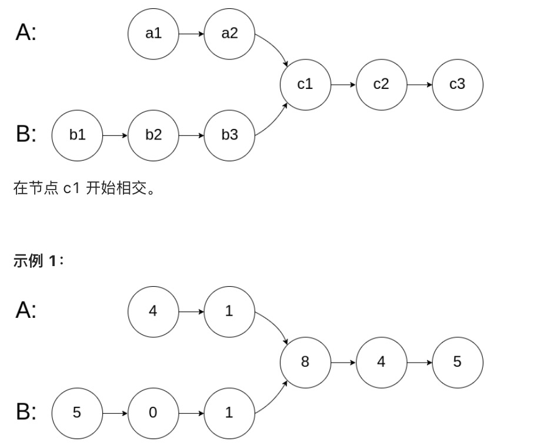

# 两个链表的第一个公共节点

## 题目

输入两个链表，找出它们的第一个公共节点



```
输入：intersectVal = 8, listA = [4,1,8,4,5], listB = [5,0,1,8,4,5], skipA = 2, skipB = 3
输出：Reference of the node with value = 8
输入解释：相交节点的值为 8 （注意，如果两个列表相交则不能为 0）。从各自的表头开始算起，链表 A 为 [4,1,8,4,5]，链表 B 为 [5,0,1,8,4,5]。在 A 中，相交节点前有 2 个节点；在 B 中，相交节点前有 3 个节点。
```

## 解答
```js
var getIntersectionNode = function(headA, headB) {
    let a = headA
    let b = headB
    while(a !== b) {
        a = a ? a.next : headB;
        b = b ? b.next : headA
    }
    return a
};
```

两个链表长度分别为L1+C、L2+C， C为公共部分的长度，
第一个人走了L1+C步后，回到第二个人起点走L2步；第2个人走了L2+C步后，回到第一个人起点走L1步。 当两个人走的步数都为L1+L2+C时就两个家伙就相遇了