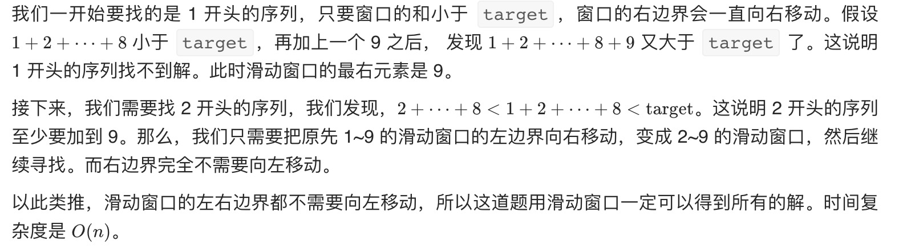

# 和为s的连续正数序列

## 题目

输入一个正整数 target ，输出所有和为 target 的连续正整数序列（至少含有两个数）。

序列内的数字由小到大排列，不同序列按照首个数字从小到大排列。

示例：
```
输入：target = 9
输出：[[2,3,4],[4,5]]

输入：target = 15
输出：[[1,2,3,4,5],[4,5,6],[7,8]]
```

## 解答
```js
var findContinuousSequence = function (target) {
  // 暴力循环
	// const arr = [];
	// for (let i = 1; i < target; i++) {
	//     let sum = i;
	//     for (let j = i + 1; j <= target - i; j++) {
	//         sum = sum + j;
	//         if (sum === target) {
	//             arr.push(Array.from({ length: j - i + 1 }, (item, index) => i + index))
	//             break;
	//         } else if (sum > target) {
	//             break;
	//         }
	//     }
	// }
	// return arr;

	let i = 1;
	let j = 1;
	const arr = [];
	let sum = 0;
	while (i <= target / 2) {   // 5最大可能是2+3 不可能是3+4
		if (sum < target) {
			sum = sum + j;
			j++;
		} else if (sum > target) {
			sum = sum - i;
			i++;
		} else {
			const a = Array.from({ length: j - i }, (item, index) => i + index);
			arr.push(a);
			sum = sum - i;
			i++;
		}
	}
	return arr;
};
```

滑动窗口

1. 当窗口的和小于 target 的时候，窗口的和需要增加，所以要扩大窗口，窗口的右边界向右移动
2. 当窗口的和大于 target 的时候，窗口的和需要减少，所以要缩小窗口，窗口的左边界向右移动
3. 当窗口的和恰好等于 target 的时候，我们需要记录此时的结果。设此时的窗口为 [i, j)，那么我们已经找到了一个 i 开头的序列，也是唯一一个 i 开头的序列，接下来需要找 i+1 开头的序列，所以窗口的左边界要向右移动



