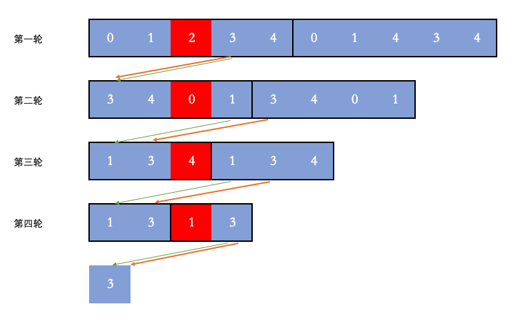

# 圆圈中最后剩下的数字

## 题目
0,1,···,n-1这n个数字排成一个圆圈，从数字0开始，每次从这个圆圈里删除第m个数字（删除后从下一个数字开始计数）。求出这个圆圈里剩下的最后一个数字。

例如，0、1、2、3、4这5个数字组成一个圆圈，从数字0开始每次删除第3个数字，则删除的前4个数字依次是2、0、4、1，因此最后剩下的数字是3。

示例：
```
输入: n = 5, m = 3
输出: 3

输入: n = 10, m = 17
输出: 2
```

## 解答
```js
var lastRemaining = function (n, m) {
	// let arr = [];
	// let i;
	// for (i = 0; i < n; i++) {
	//     arr.push(i)
	// }
	// i = 0;
	// while (arr.length !== 1) {
	//     i = (i + m - 1) % arr.length;
	//     arr.splice(i, 1)
	// }
	// return arr[0]

	let ans = 0;
	// 最后一轮剩下2个人，所以从2开始反推
	for (let i = 2; i <= n; i++) {
		ans = (ans + m) % i;
	}
	return ans;
};
```

思路1:
假设当前删除的位置是 idxidx，下一个删除的数字的位置是 idx + midx+m 。但是，由于把当前位置的数字删除了，后面的数字会前移一位，所以实际的下一个位置是 idx + m - 1idx+m−1。由于数到末尾会从头继续数，所以最后取模一下，就是 (idx + m - 1)（mod n）

思路2:


