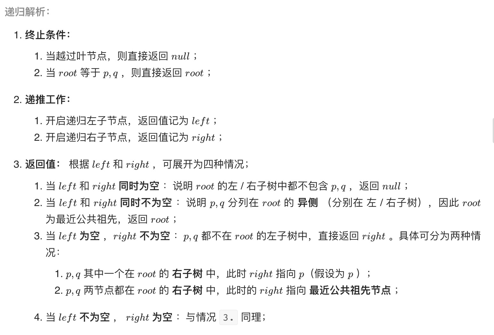

#  二叉树的最近公共祖先

## 题目

给定一个二叉树, 找到该树中两个指定节点的最近公共祖先。

百度百科中最近公共祖先的定义为：“对于有根树 T 的两个结点 p、q，最近公共祖先表示为一个结点 x，满足 x 是 p、q 的祖先且 x 的深度尽可能大（一个节点也可以是它自己的祖先）。”

例如，给定如下二叉树:  root = [3,5,1,6,2,0,8,null,null,7,4]

## 解答
```js
var lowestCommonAncestor = function (root, p, q) {
	if (root == null || root == p || root == q) return root;
	let left = lowestCommonAncestor(root.left, p, q);
	let right = lowestCommonAncestor(root.right, p, q);
	if (left == null) return right;
	if (right == null) return left;
	return root;
};
```


