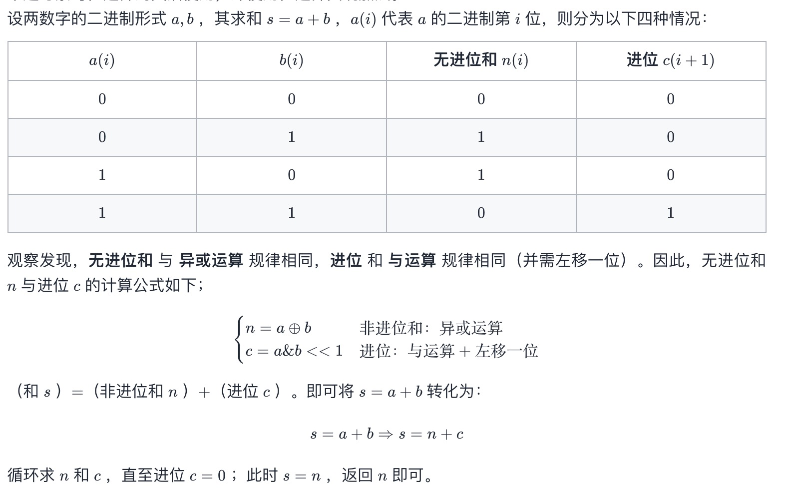

# 不用加减乘除做加法

## 题目
写一个函数，求两个整数之和，要求在函数体内不得使用 “+”、“-”、“*”、“/” 四则运算符号。

示例:
```
输入: a = 1, b = 1
输出: 2
```

提示：
```
a, b 均可能是负数或 0
结果不会溢出 32 位整数
```

## 解答
```js
function add(a, b) {
    while(b != 0) { // 当进位为 0 时跳出
        let c = (a & b) << 1;  // c = 进位
        a ^= b; // a = 非进位和
        b = c; // b = 进位
    }
    return a;
}
```



观察发现，无进位和 与 异或运算 规律相同，进位 和 与运算 规律相同（并需左移一位）。 
* 非进位和：异或运算
* 进位：与运算+左移一位

（和 s ）=（非进位和 n ）+（进位 c ）。即可将 s = a + b 转化为：
```
s=a+b⇒s=n+c
```
循环求 n 和 c ，直至进位 c = 0 ；此时 s = n ，返回 n 即可。
