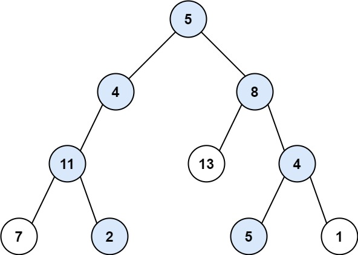

# 二叉树中和为某一值的路径

## 题目

给你二叉树的根节点 root 和一个整数目标和 targetSum ，找出所有 从根节点到叶子节点 路径总和等于给定目标和的路径。

叶子节点 是指没有子节点的节点。

示例1:

```
输入：root = [5,4,8,11,null,13,4,7,2,null,null,5,1], targetSum = 22
输出：[[5,4,11,2],[5,8,4,5]]
```

示例2:

```
输入：root = [1,2,3], targetSum = 5
输出：[]
```

示例3:
```
输入：root = [1,2], targetSum = 0
输出：[]
```

提示：
```
树中节点总数在范围 [0, 5000] 内
-1000 <= Node.val <= 1000
-1000 <= targetSum <= 1000
```

## 解答
```js
var pathSum = function(root, target) {
  const path = [];
  const res = [];
  dfs(root, target);
  return res;

  function dfs(root,tar) {
    if(root === null) return;
    path.push(root.val);
    tar = tar - root.val;
    if(tar === 0 && root.left === null && root.right === null) {
      res.push([...path]);
    }
    dfs(root.left, tar);
    dfs(root.right, tar);
    path.pop();
  }
};
```

* 先序遍历： 按照 “根、左、右” 的顺序，遍历树的所有节点。
* 路径记录： 在先序遍历中，记录从根节点到当前节点的路径。当路径为 ① 根节点到叶节点形成的路径 且 ② 各节点值的和等于目标值 sum 时，将此路径加入结果列表。

算法流程：

pathSum(root, sum) 函数：
```
初始化： 结果列表 res ，路径列表 path 。
返回值： 返回 res 即可。
```
recur(root, tar) 函数：
```
递推参数： 当前节点 root ，当前目标值 tar 。
终止条件： 若节点 root 为空，则直接返回。

递推工作：
路径更新： 将当前节点值 root.val 加入路径 path ；
目标值更新： tar = tar - root.val（即目标值 tar 从 sum 减至 0 ）；
路径记录： 当 ① root 为叶节点 且 ② 路径和等于目标值 ，则将此路径 path 加入 res 。
先序遍历： 递归左 / 右子节点。
路径恢复： 向上回溯前，需要将当前节点从路径 path 中删除，即执行 path.pop() 。
```