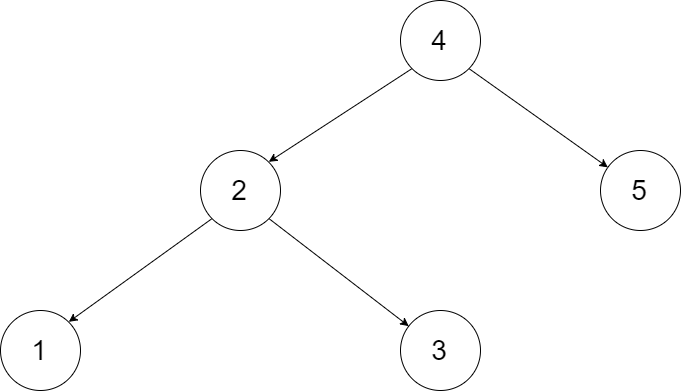

# 二叉搜索树与双向链表

## 题目
输入一棵二叉搜索树，将该二叉搜索树转换成一个排序的循环双向链表。要求不能创建任何新的节点，只能调整树中节点指针的指向。

为了让您更好地理解问题，以下面的二叉搜索树为例：

 

我们希望将这个二叉搜索树转化为双向循环链表。链表中的每个节点都有一个前驱和后继指针。对于双向循环链表，第一个节点的前驱是最后一个节点，最后一个节点的后继是第一个节点。

下图展示了上面的二叉搜索树转化成的链表。“head” 表示指向链表中有最小元素的节点。

 

特别地，我们希望可以就地完成转换操作。当转化完成以后，树中节点的左指针需要指向前驱，树中节点的右指针需要指向后继。还需要返回链表中的第一个节点的指针。


## 解答
### 思路1
1. 前序遍历存储到数组
2. 遍历数组分别设置前置和后置，对头节点和根结点做特殊处理
```js
var treeToDoublyList = function (root) {
  let index = 0;
  dfs(root);

  while (index < arr.length) {
    arr[index].left = index !== 0 ? arr[index - 1] : arr[arr.length - 1];
    arr[index].right = index !== arr.length - 1 ? arr[index + 1] : arr[0];
    index++;
  }
  return arr[0];
  function dfs(root) {
    if (root === null) return;
    dfs(root.left);
    arr.push(root);
    dfs(root.right);
  }
};
```
### 思路2
1. 排序链表： 节点应从小到大排序，因此应使用 中序遍历 “从小到大”访问树的节点。
2. 双向链表： 在构建相邻节点的引用关系时，设前驱节点 pre 和当前节点 cur ，不仅应构建 pre.right = cur ，也应构建 cur.left = pre 。
3. 循环链表： 设链表头节点 head 和尾节点 tail ，则应构建 head.left = tail 和 tail.right = head 。

dfs(cur): 递归法中序遍历；
```
终止条件： 当节点 cur 为空，代表越过叶节点，直接返回；
递归左子树，即 dfs(cur.left) ；
构建链表：
  当 pre 为空时： 代表正在访问链表头节点，记为 head ；
  当 pre 不为空时： 修改双向节点引用，即 pre.right = cur ， cur.left = pre ；
  保存 cur ： 更新 pre = cur ，即节点 cur 是后继节点的 pre ；
递归右子树，即 dfs(cur.right) ；
```
treeToDoublyList(root)：
```
特例处理： 若节点 root 为空，则直接返回；
初始化： 空节点 pre ；
转化为双向链表： 调用 dfs(root) ；
构建循环链表： 中序遍历完成后，head 指向头节点， pre 指向尾节点，因此修改 head 和 pre 的双向节点引用即可；
返回值： 返回链表的头节点 head 即可；
```
```js
var treeToDoublyList = function(root) {
  if(root === null) return root;
  let pre;
  let head;
  dfs(root);
  head.left = pre;
  pre.right = head;
  return head;
  
  function dfs(cur) {
    if(cur === null) return;
    dfs(cur.left)
    if(pre) {
      pre.right = cur;
      cur.left = pre;
    } else {
      head = cur;
    }
    pre = cur;
    dfs(cur.right)
  }
};
```