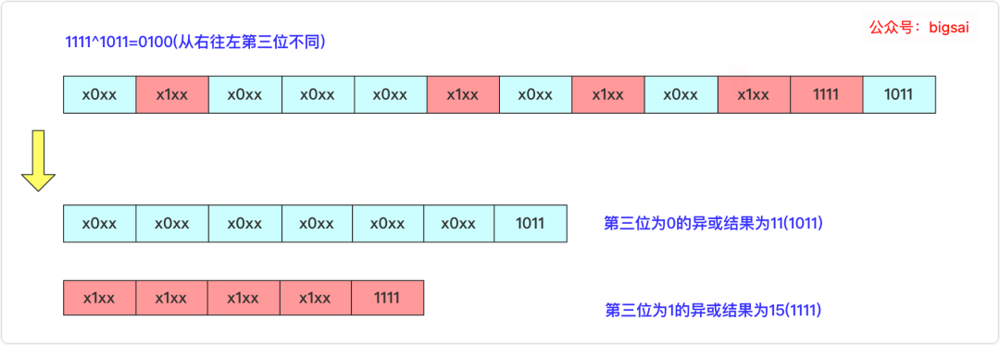
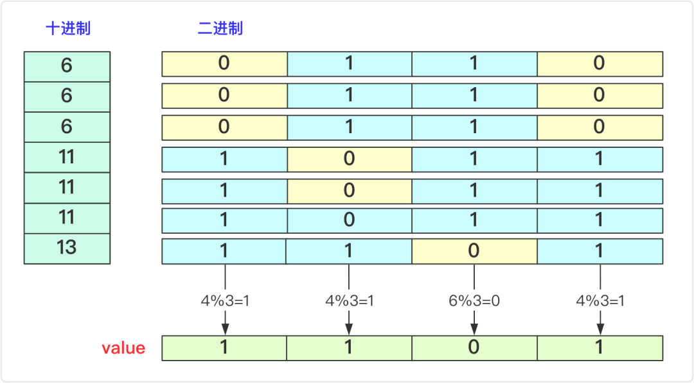
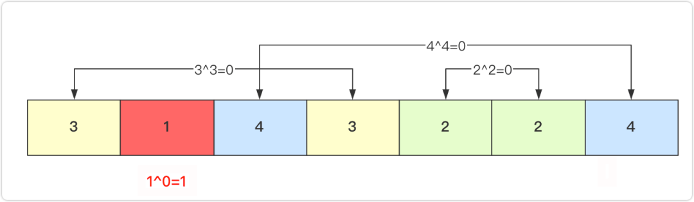

# 数组中数字出现的次数

## 题目1
一个整型数组 nums 里除两个数字之外，其他数字都出现了两次。请写程序找出这两个只出现一次的数字。要求时间复杂度是O(n)，空间复杂度是O(1)。

示例 1：
```
输入：nums = [4,1,4,6]
输出：[1,6] 或 [6,1]
```
示例 2：
```
输入：nums = [1,2,10,4,1,4,3,3]
输出：[2,10] 或 [10,2]
```

限制：
```
2 <= nums.length <= 10000
```

### 解答
```js
var singleNumbers = function(nums) {
  let value = 0;
  for(let i = 0 ; i < nums.length ; i++) {
    value ^= nums[i]
  }
  const arr = [0,0];
  let index = getFirst1(value);
  for(let i = 0 ; i < nums.length ;i++) {
   if((nums[i] >>> index) & 1 === 1) {
     arr[1] ^= nums[i]
   } else {
     arr[0] ^= nums[i] 
   }
  }
  return arr
};

function getFirst1(num) {
  let index = 0;
  while(num !== 0) {
    if(num & 1) break;
    index++;
    num >>>= 1;
  }
  return index;
}
```

想办法将数组逻辑上一分为二！

先异或一遍到最后得到一个数，得到的肯定是 a^b (假设两个数值分别为a和b)的值。在看异或^的属性：不同为 1，相同为 0。 也就是说最终这个结果的二进制为 1 的位置上 a 和 b 是不相同的。而我们可以找到这个第一个不同的位，然后将数组中的数分成两份，该位为 0 的进行异或求解得到其中一个结果 a，该位为 1 的进行异或求解得到另一个结果 b。


## 题目2
在一个数组 nums 中除一个数字只出现一次之外，其他数字都出现了三次。请找出那个只出现一次的数字。

示例 1：
```
输入：nums = [3,4,3,3]
输出：4
```
示例 2：
```
输入：nums = [9,1,7,9,7,9,7]
输出：1
```

限制：
```
1 <= nums.length <= 10000
1 <= nums[i] < 2^31
```

### 解答
```js
var singleNumber = function(nums) {
  let value = 0;
  const arr = [0,0];
  for(let i = 0 ; i < 32 ; i++) {
    let sum = 0
    for (const num of nums) {
      if(num >>> i & 1) sum++
    }
    if(sum % 3) value += (1<<i)
  }
  return value;
};
```

判断整除求余操作。即判断所有数字二进制 1 的总个数和 0 的总个数，一定有一个不是三的整数倍，如果 0 不是三的整数倍那么就说明结果的该位二进制数字为 0，同理否则为 1。

在具体的操作实现上，问题中给出数组中的数据在 int 范围之内，那么我们就可以在实现上可以对 int 的 32 个位每个位进行依次判断，该位 1 的个数求余 3 后是否为 1，如果为 1 说明结果该位二进制为 1，可以将结果加上去。最终得到的值即为答案。

## 题目3 
一个整型数组 nums 里除一个数字之外，其他数字都出现了两次。请写程序找出这个只出现一次的数字。要求时间复杂度是O(n)，空间复杂度是O(1)。

示例 1：
```
输入：nums = [4,1,4,1,5,6]
输出：[5,6] 或 [6,5]
```

### 解答
```js
var singleNumbers = function(nums) {
  let value = 0;
  for(let i = 0 ; i < nums.length ; i++) {
    value ^= nums[i]
  }
  return value;
};
```

1. 0 和任意数字进行异或操作结果为数字本身.
2. 两个相同的数字进行异或的结果为 0.

具体的操作就是用 0 开始和数组中每个数进行异或，得到的值和下个数进行异或，最终获得的值就是出现一次(奇数次)的值。

