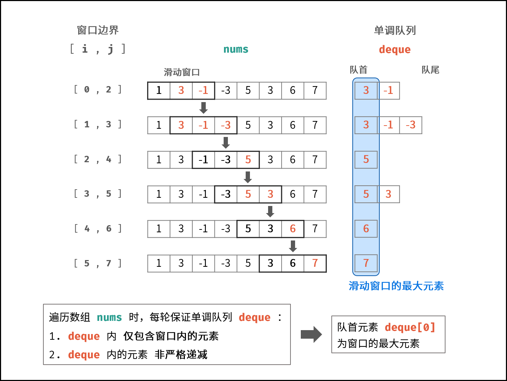

# 滑动窗口的最大值

## 题目
给定一个数组 nums 和滑动窗口的大小 k，请找出所有滑动窗口里的最大值。

示例:
```
输入: nums = [1,3,-1,-3,5,3,6,7], 和 k = 3
输出: [3,3,5,5,6,7] 
解释: 

  滑动窗口的位置                最大值
---------------               -----
[1  3  -1] -3  5  3  6  7       3
 1 [3  -1  -3] 5  3  6  7       3
 1  3 [-1  -3  5] 3  6  7       5
 1  3  -1 [-3  5  3] 6  7       5
 1  3  -1  -3 [5  3  6] 7       6
 1  3  -1  -3  5 [3  6  7]      7
```
提示：
```
你可以假设 k 总是有效的，在输入数组不为空的情况下，1 ≤ k ≤ 输入数组的大小。
```

## 解答
```js
var maxSlidingWindow = function (nums, k) {
  if (nums.length == 0 || k == 0) return [];
  let deque = [];
  let res = [];
  // 未形成窗口
  for (let i = 0; i < k; i++) {
    while (deque.length && deque[deque.length - 1] < nums[i]) deque.pop();
    deque.push(nums[i]);
  }
  res.push(deque[0]);
  // 形成窗口后
  for (let i = k; i < nums.length; i++) {
    if (deque[0] == nums[i - k]) deque.shift();
    while (deque.length && deque[deque.length - 1] < nums[i]) deque.pop();
    deque.push(nums[i]);
    res.push(deque[0]);
  }
  return res;
};
```

设窗口区间为 [i, j] ，最大值为 x_j。当窗口向前移动一格，则区间变为 [i+1,j+1] ，即添加了 nums[j + 1] ，删除了 nums[i] 。

若只向窗口 [i, j] 右边添加数字 nums[j + 1] ，则新窗口最大值可以 通过一次对比 使用 O(1) 时间得到，即：
```
x_{j+1} = max(x_j,nums[j+1])
```
而由于删除的 nums[i] 可能恰好是窗口内唯一的最大值 x_j ，因此不能通过以上方法计算 x_{j+1}，而必须使用 O(j-i) 时间， 遍历整个窗口区间 获取最大值，即：
```
x_{j+1} = max(nums(i+1),⋯,num(j+1))
```
根据以上分析，可得 暴力法 的时间复杂度为 O((n−k+1)k)≈O(nk) 。

设数组 nums 的长度为 n ，则共有 (n-k+1) 个窗口；获取每个窗口最大值需线性遍历，时间复杂度为 O(k) 。


窗口对应的数据结构为 双端队列 ，本题使用 单调队列 即可解决以上问题。遍历数组时，每轮保证单调队列 deque ：

1. deque 内 仅包含窗口内的元素 ⇒ 每轮窗口滑动移除了元素 nums[i - 1] ，需将 deque 内的对应元素一起删除。
2. deque 内的元素 非严格递减 ⇒ 每轮窗口滑动添加了元素 nums[j + 1] ，需将 deque 内所有 < nums[j + 1] 的元素删除。

算法流程：
* 初始化： 双端队列 deque ，结果列表 res ，数组长度 n ；
* 滑动窗口： 左边界范围 i∈[1−k,n−k] ，右边界范围 j∈[0,n−1] ；
* 若 i > 0 且 队首元素 deque[0] == 被删除元素 nums[i - 1] ：则队首元素出队；
* 删除 deque 内所有 < nums[j] 的元素，以保持 deque 递减；
* 将 nums[j] 添加至 deque 尾部；
* 若已形成窗口（即 i≥0 ）：将窗口最大值（即队首元素 deque[0] ）添加至列表 res ；
* 返回值： 返回结果列表 res ；
