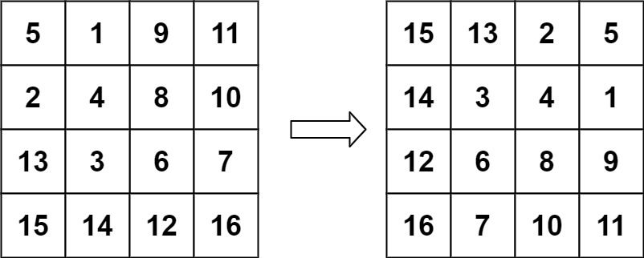

# 旋转图像

## 题目

给定一个 n × n 的二维矩阵 matrix 表示一个图像。请你将图像顺时针旋转 90 度。

你必须在 原地 旋转图像，这意味着你需要直接修改输入的二维矩阵。请不要 使用另一个矩阵来旋转图像。


示例 1：

```
输入：matrix = [[1,2,3],[4,5,6],[7,8,9]]
输出：[[7,4,1],[8,5,2],[9,6,3]]
```


示例 2：
```
输入：matrix = [[5,1,9,11],[2,4,8,10],[13,3,6,7],[15,14,12,16]]
输出：[[15,13,2,5],[14,3,4,1],[12,6,8,9],[16,7,10,11]]
```
 

提示：
```
n == matrix.length == matrix[i].length
1 <= n <= 20
-1000 <= matrix[i][j] <= 1000
```

## 解答

### 从外到内
自外向内一共有不超过 n/2 层（单个中心元素不算一层）矩形框。对于第 times 层矩形框，其框边长 len=nums-(times*2)，将其顺时针分为 4 份 len-1 的边，对四条边进行元素的循环交换即可。


```js
var rotate = function (matrix) {
  if (matrix.length == 0 || matrix.length != matrix[0].length) {
    return;
  }
  let nums = matrix.length;
  let times = 0;
  while (times <= Math.floor(nums / 2)) {
    let len = nums - times * 2;
    for (let i = 0; i < len - 1; ++i) {
      let temp = matrix[times][times + i];
      matrix[times][times + i] = matrix[times + len - i - 1][times];
      matrix[times + len - i - 1][times] = matrix[times + len - 1][times + len - i - 1];
      matrix[times + len - 1][times + len - i - 1] = matrix[times + i][times + len - 1];
      matrix[times + i][times + len - 1] = temp;
    }
    ++times;
  }
  return matrix;
};
```

### 两次翻转

先沿右上 - 左下的对角线翻转（270° + 一次镜像），再沿水平中线上下翻转（−180° + 一次镜像），可以实现顺时针 90 度的旋转效果

```js
var rotate = function (matrix) {
  if (matrix.length == 0 || matrix.length != matrix[0].length) {
    return;
  }
  let nums = matrix.length;
  for (let i = 0; i < nums; ++i) {
    for (let j = 0; j < nums - i; ++j) {
      let temp = matrix[i][j];
      matrix[i][j] = matrix[nums - 1 - j][nums - 1 - i];
      matrix[nums - 1 - j][nums - 1 - i] = temp;
    }
  }
  for (let i = 0; i < nums / 2; ++i) {
    for (let j = 0; j < nums; ++j) {
      let temp = matrix[i][j];
      matrix[i][j] = matrix[nums - 1 - i][j];
      matrix[nums - 1 - i][j] = temp;
    }
  }

  return matrix;
};
```
